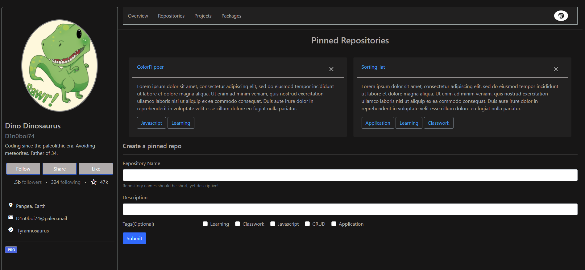
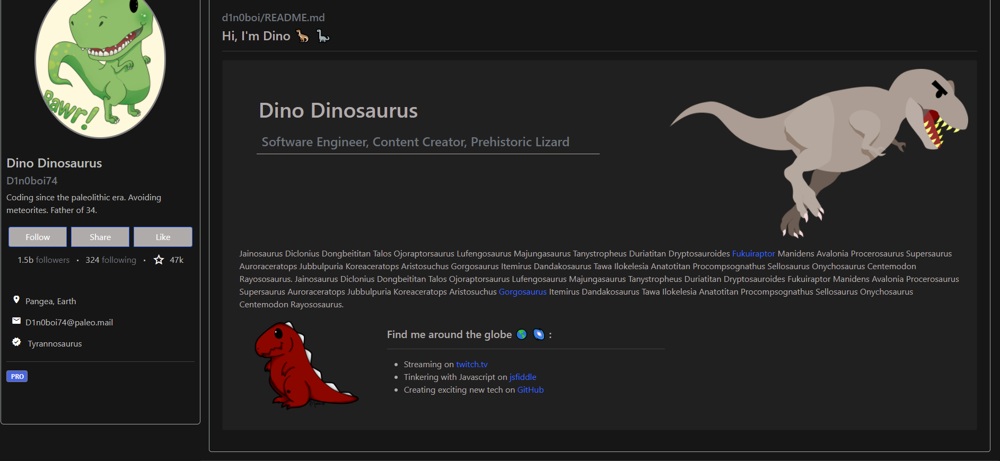
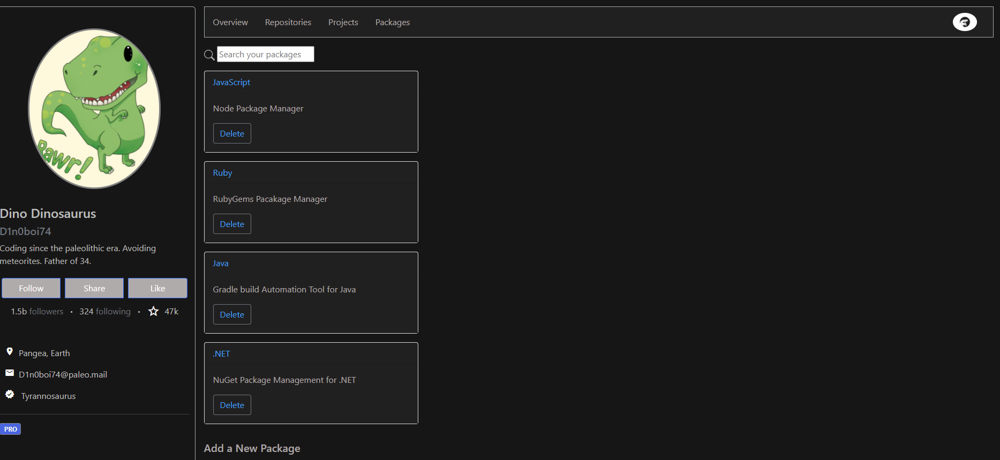
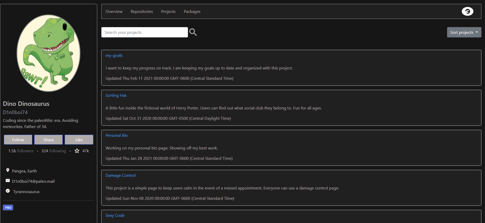
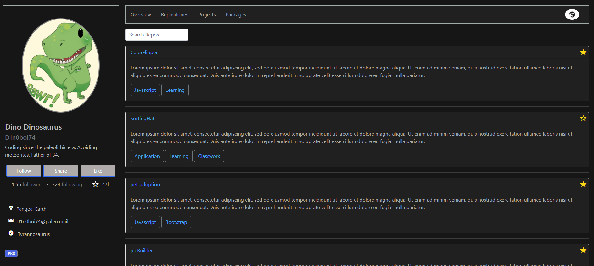

# GitSub

GitSub is a GitHub clone that features four unique pages each developed by an individual developer on the team. This site features forms, search bars, card deletion, sorting, and more!

### Wireframe (Credit to NSS)

https://www.figma.com/file/8vIX1yEXd2UxdWARbWqAje/GitSub?node-id=5%3A20

### Deployed Project

[Coming Soon!]()

### Project Board

https://github.com/nss-evening-cohort-14/gitsub-devlopmentdinos/projects/1

### User Description

Our user is able to quickly and efficiently keep track of version controlling, packages, and project boards for their codebase. They are able to streamline the coding process and work effectively with others to create exciting new applications for the world.

### Features
##### All Pages
 - Static navbar that features links to each page.
 - Dynamically added profile sidebar
 - Static footer that links to various things.
##### Overview Page (Landing)
  - Clicking on the profile picture on lefthand side will open an "About Me"
  - Ability to view pinned repositories in the main section.
     - Can delete pinned repositores off of the page.
  - Form that allows you to push a repository up and automatically set it as pinned.
     - Can add common tags to the pushed repository in the form
##### Repositories Page
  - Search bar that allows user to fuzzy search through the repositories on the user's account.
  - Can pin repositories by clicking the gold start on the right side of repository card.
  - Form that allows user to add new repositories
    - Can input up to three tags using text input fields.
##### Projects Page
  - Search bar that allows user to fuzzy search through the project board on the user's account.
  - Can sort the list of projects by name, time created(Precambrian), and time created(Holocene)
  - Form that allows user to add new project boards.
##### Packages Page
  - Search bar that allows user to fuzzy search through the packages installed on the users account.
  - User can delete packages from this page
  - User can add new packages to existing package list through form at bottom of page

### Screenshots
Overview

Overview - Aboutme

Packages

Projects

Repositories

### Loom Walkthroughs

- [Overview](https://www.loom.com/share/6e56c55baa27451db370431f5002628b)
- [Packages](https://www.loom.com/share/1dc73039f1f14945a4d3e8e39f35f83f)

- [Projects](https://www.loom.com/share/5915fbcf2cd148fdbfec61c0bbab0200)

- [Repositories](https://www.loom.com/share/4d57900dcb0c4f08bda6227ddb6c47de)

### Contributors

- [Jesse Robinson](https://github.com/jrobinson0529) - Overview Page
- [Chris Meffley](https://github.com/cmeffley) - Packages Page
- [Casey Walker](https://github.com/caseywalker) - Repositories Page
- [Tad Sekeres](https://github.com/tsekeres) - Projects Page
